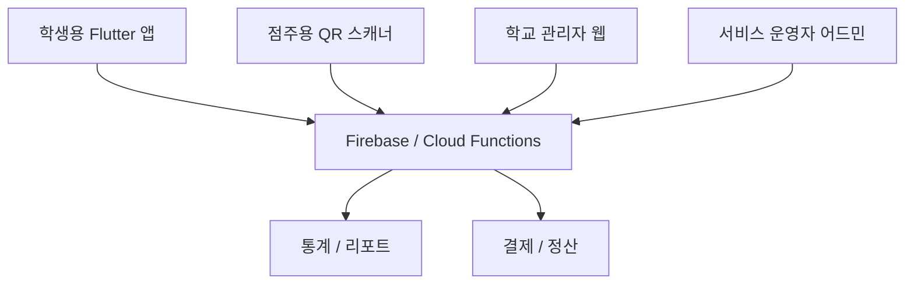
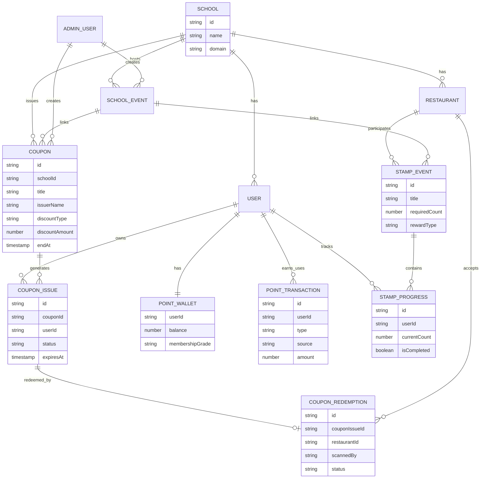

# 대학교 밥먹자 캠퍼스 복지 플랫폼 확장 설계서

## 1. 서비스 방향

대학교 밥먹자는 단순 음식 주문 앱이 아니라 학생의 식생활, 학교 복지, 학교 행사, 주변 상권을 연결하는 캠퍼스 생활 플랫폼으로 확장한다.

최종 목표는 다음 기능을 하나의 앱에서 제공하는 것이다.

- 학식 정보
- 학교 주변 식당
- 음식 주문
- 메뉴 추천
- 시간표 기반 추천
- 학교 공식 쿠폰
- 학생 포인트
- 등급 혜택
- 스탬프 이벤트
- 학교 행사 연동
- 학생 복지 서비스
- 관리자 통계

핵심 포지셔닝:

```text
대학생들의 식생활과 복지를 연결하는 캠퍼스 플랫폼
```

## 2. 사용자와 이해관계자

### 학생

- 학교 공식 쿠폰을 받고 사용한다.
- 리뷰, 출석, 방문 인증으로 포인트를 적립한다.
- 포인트로 쿠폰, 할인, 굿즈를 교환한다.
- 행사와 시험기간 혜택을 확인한다.
- 스탬프 이벤트에 참여한다.

### 식당/카페 점주

- 학생 QR 쿠폰을 스캔한다.
- 쿠폰 사용을 승인한다.
- 방문/주문 통계를 확인한다.
- 학교 행사 참여 식당으로 등록된다.

### 학교 관리자

학교 관리자에는 여러 조직이 포함된다.

- 총장실
- 학생처
- 총학생회
- 학과 사무실
- 복지팀
- 행사 운영팀

관리자는 쿠폰, 이벤트, 공지사항, 포인트 정책, 통계를 관리한다.

### 서비스 운영자

- 학교 입점 관리
- 식당 입점 관리
- 결제/정산 관리
- 악용 탐지
- 고객센터 운영
- 데이터 분석

## 3. 제품 구조

앱은 학생용 모바일 앱, 점주용 스캐너 앱 또는 웹, 학교 관리자 웹, 서비스 운영자 어드민으로 나눈다.



## 4. Flutter 앱 구조

기존 Flutter 구조에 복지/쿠폰 도메인을 추가한다.

```text
lib/
  features/
    welfare/
      welfare_home_screen.dart
      widgets/
        welfare_benefit_card.dart
        school_event_card.dart
    coupons/
      coupon_list_screen.dart
      coupon_detail_screen.dart
      coupon_qr_screen.dart
      coupon_exchange_screen.dart
      widgets/
        coupon_card.dart
        coupon_status_badge.dart
    points/
      point_wallet_screen.dart
      point_history_screen.dart
      point_policy_screen.dart
      widgets/
        point_balance_card.dart
        point_history_item.dart
    membership/
      membership_screen.dart
      widgets/
        grade_progress_card.dart
        grade_benefit_card.dart
    stamps/
      stamp_event_list_screen.dart
      stamp_event_detail_screen.dart
      widgets/
        stamp_board.dart
        stamp_reward_card.dart
    events/
      school_event_list_screen.dart
      school_event_detail_screen.dart
    scanner/
      qr_scanner_screen.dart
      scan_result_screen.dart
  data/
    models/
      coupon.dart
      coupon_issue.dart
      coupon_redemption.dart
      point_wallet.dart
      point_transaction.dart
      membership_grade.dart
      stamp_event.dart
      stamp_progress.dart
      school_event.dart
      admin_role.dart
    repositories/
      coupon_repository.dart
      point_repository.dart
      stamp_repository.dart
      welfare_repository.dart
      admin_repository.dart
```

권장 패키지:

- `firebase_auth`
- `cloud_firestore`
- `firebase_functions`
- `firebase_messaging`
- `firebase_analytics`
- `go_router`
- `riverpod` 또는 `bloc`
- `mobile_scanner`
- `qr_flutter`
- `freezed`
- `json_serializable`

## 5. Firebase 데이터베이스 구조

Firestore 컬렉션은 학교별 멀티테넌트 구조를 지원해야 한다.

```text
schools/{schoolId}
  coupons/{couponId}
  couponIssues/{couponIssueId}
  couponRedemptions/{redemptionId}
  pointPolicies/{policyId}
  pointWallets/{userId}
  pointTransactions/{transactionId}
  membershipGrades/{gradeId}
  stampEvents/{stampEventId}
  stampProgress/{progressId}
  schoolEvents/{eventId}
  welfareNotices/{noticeId}
  adminUsers/{adminUserId}
  ownerStores/{ownerStoreId}
```

전역 운영자용 컬렉션:

```text
platformAdmins/{adminId}
globalAuditLogs/{logId}
settlements/{settlementId}
abuseSignals/{signalId}
```

## 6. 주요 데이터 모델

### coupon

쿠폰 원본 정책이다. 학교 또는 조직이 발급한다.

```json
{
  "id": "coupon-president-1000",
  "schoolId": "tuk",
  "title": "총장님 응원 쿠폰",
  "description": "학식 1,000원 할인",
  "issuerType": "presidentOffice",
  "issuerName": "총장실",
  "discountType": "fixedAmount",
  "discountAmount": 1000,
  "discountRate": null,
  "maxDiscountAmount": null,
  "minimumOrderAmount": 3000,
  "availableRestaurantIds": ["student-cafeteria"],
  "availableCategories": ["학식"],
  "startAt": "timestamp",
  "endAt": "timestamp",
  "totalIssueLimit": 5000,
  "perUserLimit": 1,
  "status": "active",
  "createdBy": "adminUserId",
  "createdAt": "timestamp"
}
```

### couponIssue

학생 개인에게 발급된 쿠폰이다.

```json
{
  "id": "issue-1",
  "schoolId": "tuk",
  "couponId": "coupon-president-1000",
  "userId": "uid",
  "status": "available",
  "issuedAt": "timestamp",
  "usedAt": null,
  "expiresAt": "timestamp",
  "redemptionId": null
}
```

쿠폰 상태:

- `available`
- `reserved`
- `used`
- `expired`
- `revoked`

### couponRedemption

QR 스캔으로 사용 처리된 이력이다.

```json
{
  "id": "redemption-1",
  "schoolId": "tuk",
  "couponIssueId": "issue-1",
  "couponId": "coupon-president-1000",
  "userId": "uid",
  "restaurantId": "student-cafeteria",
  "scannedBy": "ownerUserId",
  "qrNonce": "randomNonce",
  "discountAmount": 1000,
  "status": "completed",
  "createdAt": "timestamp"
}
```

### pointWallet

```json
{
  "userId": "uid",
  "schoolId": "tuk",
  "balance": 1250,
  "lifetimeEarned": 4200,
  "lifetimeUsed": 2950,
  "membershipGrade": "silver",
  "updatedAt": "timestamp"
}
```

### pointTransaction

```json
{
  "id": "point-tx-1",
  "schoolId": "tuk",
  "userId": "uid",
  "type": "earn",
  "source": "review",
  "amount": 10,
  "balanceAfter": 1260,
  "description": "리뷰 작성 적립",
  "relatedId": "review-1",
  "createdAt": "timestamp"
}
```

포인트 source 예시:

- `review`
- `attendance`
- `friendInvite`
- `visitVerification`
- `eventParticipation`
- `couponExchange`
- `goodsExchange`
- `adminAdjustment`

### membershipGrade

```json
{
  "id": "gold",
  "schoolId": "tuk",
  "name": "골드",
  "minLifetimePoints": 3000,
  "benefits": [
    "학식 할인 쿠폰 월 1회",
    "포인트 적립률 1.2배"
  ],
  "pointMultiplier": 1.2,
  "priority": 3
}
```

### stampEvent

```json
{
  "id": "student-cafeteria-10",
  "schoolId": "tuk",
  "title": "학생식당 10회 방문",
  "targetRestaurantIds": ["student-cafeteria"],
  "requiredCount": 10,
  "rewardType": "coupon",
  "rewardCouponId": "coupon-free-meal",
  "startAt": "timestamp",
  "endAt": "timestamp",
  "status": "active"
}
```

### stampProgress

```json
{
  "id": "progress-1",
  "schoolId": "tuk",
  "stampEventId": "student-cafeteria-10",
  "userId": "uid",
  "currentCount": 4,
  "isCompleted": false,
  "completedAt": null,
  "updatedAt": "timestamp"
}
```

### schoolEvent

```json
{
  "id": "festival-2026",
  "schoolId": "tuk",
  "title": "2026 봄 축제",
  "eventType": "festival",
  "description": "축제 기간 특별 쿠폰과 스탬프 이벤트",
  "linkedCouponIds": ["coupon-festival-10"],
  "linkedStampEventIds": ["stamp-festival"],
  "startAt": "timestamp",
  "endAt": "timestamp",
  "status": "active"
}
```

## 7. ERD



## 8. QR 쿠폰 사용 시스템

### QR 생성 흐름

1. 학생이 쿠폰 상세에서 "사용하기"를 누른다.
2. 앱이 Cloud Function `createCouponQrSession`을 호출한다.
3. 서버가 쿠폰 상태, 유효기간, 사용 가능 매장을 검증한다.
4. 서버가 짧은 만료 시간을 가진 QR 세션을 생성한다.
5. 앱은 QR payload를 표시한다.

QR payload 예시:

```json
{
  "type": "coupon",
  "schoolId": "tuk",
  "couponIssueId": "issue-1",
  "sessionId": "qr-session-1",
  "nonce": "randomNonce",
  "expiresAt": 1780000000000
}
```

QR 만료 시간은 60초에서 180초 사이를 권장한다.

### QR 스캔 흐름

1. 점주 앱 또는 관리자 웹에서 QR 스캔
2. `redeemCouponQr` Cloud Function 호출
3. 서버에서 트랜잭션 실행
4. couponIssue 상태가 `available`인지 확인
5. QR session이 유효한지 확인
6. 사용 가능 매장인지 확인
7. couponIssue를 `used`로 변경
8. couponRedemption 생성
9. 학생/점주 화면에 성공 표시

중복 사용 방지:

- Firestore transaction 사용
- couponIssue 상태 원자적 변경
- QR nonce 재사용 차단
- QR session 만료
- 동일 쿠폰 동시 스캔 방지

## 9. API 설계

Firebase Cloud Functions 기준으로 설계한다.

### 쿠폰 발급

```http
POST /admin/coupons
```

권한:

- schoolAdmin
- welfareAdmin
- councilAdmin
- departmentAdmin
- platformAdmin

요청:

```json
{
  "schoolId": "tuk",
  "title": "중간고사 응원 쿠폰",
  "issuerName": "학생처",
  "discountType": "fixedAmount",
  "discountAmount": 1500,
  "availableCategories": ["카페"],
  "startAt": "timestamp",
  "endAt": "timestamp",
  "totalIssueLimit": 3000,
  "perUserLimit": 1
}
```

### 학생 쿠폰 목록

```http
GET /users/me/coupons?status=available
```

### QR 세션 생성

```http
POST /coupons/{couponIssueId}/qr-session
```

### QR 사용 처리

```http
POST /owner/coupons/redeem
```

요청:

```json
{
  "sessionId": "qr-session-1",
  "couponIssueId": "issue-1",
  "nonce": "randomNonce",
  "restaurantId": "student-cafeteria"
}
```

### 포인트 적립

```http
POST /points/earn
```

서버 내부 또는 검증된 이벤트에서만 호출한다.

### 포인트 사용

```http
POST /points/use
```

요청:

```json
{
  "useType": "couponExchange",
  "amount": 500,
  "targetCouponId": "coupon-cafe-500"
}
```

### 스탬프 지급

```http
POST /stamps/grant
```

권장 지급 조건:

- QR 방문 인증
- 주문 완료
- 점주 승인

### 관리자 통계

```http
GET /admin/stats/overview?schoolId=tuk&period=monthly
```

응답:

```json
{
  "activeUsers": 12450,
  "couponIssued": 5200,
  "couponUsed": 3810,
  "pointEarned": 820000,
  "pointUsed": 430000,
  "eventParticipants": 2400,
  "topRestaurants": []
}
```

## 10. 관리자 페이지 설계

관리자 페이지는 웹으로 만든다.

권장 스택:

- Flutter Web 또는 Next.js
- Firebase Auth
- Firestore
- Cloud Functions
- Chart.js 또는 Recharts

실무적으로는 관리자 페이지는 Next.js가 더 빠르게 만들기 좋다. 모바일 앱은 Flutter, 관리자 웹은 Next.js 조합을 권장한다.

### 관리자 IA

```text
대시보드
쿠폰 관리
  쿠폰 목록
  쿠폰 생성
  발급 대상 설정
  사용 현황
이벤트 관리
  학교 행사
  스탬프 이벤트
  경품 이벤트
포인트 관리
  적립 정책
  사용 정책
  수동 지급/회수
공지사항
식당 관리
학생 관리
통계
권한 관리
감사 로그
```

### 대시보드

표시:

- 오늘 활성 사용자
- 쿠폰 사용률
- 포인트 사용량
- 인기 식당 순위
- 이벤트 참여율
- QR 스캔 성공/실패
- 신고/이상 사용 알림

### 쿠폰 생성 화면

입력:

- 쿠폰명
- 발급기관
- 할인 유형
- 할인 금액/비율
- 최소 주문 금액
- 사용 가능 식당/카테고리
- 발급 대상
- 총 발급 수량
- 1인당 제한
- 유효기간
- 노출 배너 이미지

발급 대상:

- 전체 학생
- 특정 학과
- 특정 학번
- 신입생
- 행사 참여자
- 시험기간 대상자
- 수동 CSV 업로드

### 포인트 정책 관리

예시:

```text
리뷰 작성 +10P
출석 체크 +5P
친구 초대 +50P
식당 방문 인증 +20P
이벤트 참여 +30P
```

정책에는 일일 제한이 필요하다.

- 리뷰 포인트: 하루 최대 30P
- 출석 체크: 하루 1회
- 친구 초대: 실제 가입/학교 인증 후 지급
- 방문 인증: 동일 매장 하루 1회

## 11. 권한 체계

### 학생 권한

- 쿠폰 조회
- 쿠폰 사용 QR 생성
- 포인트 조회
- 포인트 사용
- 스탬프 참여
- 리뷰 작성
- 혼밥 메이트 참여

### 점주 권한

- 자기 매장 쿠폰 QR 스캔
- 자기 매장 쿠폰 사용 이력 조회
- 자기 매장 주문 조회
- 자기 매장 메뉴 관리
- 자기 매장 통계 조회

### 학교 관리자 권한

공통:

- 학교 데이터 조회
- 학교 행사 관리
- 학교 공지 작성

세부 역할:

```text
presidentOfficeAdmin
studentAffairsAdmin
studentCouncilAdmin
departmentAdmin
welfareAdmin
eventAdmin
readOnlyAdmin
```

### 플랫폼 관리자 권한

- 모든 학교 관리
- 학교 생성/비활성화
- 관리자 권한 부여
- 결제/정산 관리
- 신고/제재 관리
- 감사 로그 조회

권한 구현:

- Firebase Auth custom claims
- Firestore adminUsers 문서
- Cloud Functions에서 서버 검증
- 클라이언트 UI 권한은 보조 수단일 뿐 보안 기준이 아니다.

## 12. 화면 설계

### 학생 앱 화면

쿠폰/복지 탭:

1. 보유 쿠폰
2. 받을 수 있는 쿠폰
3. 포인트
4. 스탬프 이벤트
5. 학교 행사

쿠폰 카드:

```text
총장님 응원 쿠폰
학식 1,000원 할인
총장실
학생식당 사용 가능
2026.06.30까지
[사용하기]
```

포인트 지갑:

```text
1,250P
실버 등급
다음 골드까지 750P

최근 내역
리뷰 작성 +10P
학식 할인 사용 -500P
```

스탬프 이벤트:

```text
학생식당 10회 방문
4 / 10
보상: 학식 무료 쿠폰
```

### 점주 화면

주요 화면:

- QR 스캔
- 스캔 결과
- 오늘 사용 쿠폰
- 정산 내역
- 매장 통계

스캔 성공:

```text
사용 완료
중간고사 응원 쿠폰
1,500원 할인
```

스캔 실패:

```text
사용할 수 없는 쿠폰
이미 사용되었거나 유효기간이 지났습니다.
```

### 관리자 웹 화면

주요 화면:

- 대시보드
- 쿠폰 생성/수정
- 쿠폰 발급 현황
- 이벤트 생성
- 포인트 정책
- 스탬프 이벤트
- 통계 리포트
- 권한 관리
- 감사 로그

## 13. UI/UX 설계

### 학생 앱

원칙:

- 혜택을 먼저 보여준다.
- 쿠폰 사용은 2번 터치 안에 끝낸다.
- 포인트와 등급은 게임처럼 보이게 한다.
- 스탬프는 시각적으로 채워지는 재미를 준다.
- 학교 공식 혜택은 신뢰감 있게 표현한다.

추천 홈 배치:

1. 오늘 받을 수 있는 혜택
2. 보유 쿠폰
3. 포인트 지갑
4. 진행 중인 스탬프
5. 학교 행사

### 쿠폰 색상 체계

- 학교 공식 쿠폰: 학교 대표색
- 축제 쿠폰: 밝고 경쾌한 색
- 시험기간 쿠폰: 따뜻한 응원 톤
- 카페 쿠폰: 민트/브라운 보조색
- 만료 임박: 빨간색 대신 부드러운 코랄

### 관리자 UX

원칙:

- 쿠폰 발급 실수 방지
- 발급 전 미리보기
- 발급 후 수정 제한 명확화
- 사용 통계 즉시 확인
- 위험 작업은 2단계 확인

## 14. 서비스 운영 구조

### 운영 조직

초기:

- 서비스 운영자 1명
- 개발자 1명
- 학교 담당자 1명
- 식당 담당자 1명

확장:

- 학교별 Account Manager
- CS 담당
- 정산 담당
- 데이터 분석 담당
- 보안/인프라 담당

### 운영 프로세스

쿠폰 발급:

1. 학교 관리자 쿠폰 생성
2. 내부 승인 또는 자동 승인
3. 발급 대상 검증
4. 쿠폰 공개
5. 사용 현황 모니터링
6. 종료 후 리포트 발행

포인트 정산:

1. 적립 이벤트 발생
2. 중복/악용 검증
3. 포인트 지급
4. 월별 사용량 집계
5. 학교/제휴처 비용 정산

점주 정산:

1. 쿠폰 사용 내역 집계
2. 주문 결제 내역 집계
3. 쿠폰 부담 주체 확인
4. 정산 리포트 생성
5. 지급

## 15. 통계 시스템

관리자 지표:

- 인기 식당 순위
- 쿠폰 발급 수
- 쿠폰 사용 수
- 쿠폰 사용률
- 포인트 적립량
- 포인트 사용량
- 학생 참여율
- 이벤트 참여 통계
- 방문자 수
- 재방문율
- 학과별 참여율
- 학년별 참여율
- 시간대별 식당 이용량

식당 지표:

- 방문 인증 수
- 쿠폰 사용 수
- 주문 수
- 리뷰 수
- 평균 별점
- 재방문율

학생 지표:

- 보유 쿠폰
- 사용 쿠폰
- 포인트 잔액
- 등급
- 스탬프 진행률

## 16. 수익 모델

### 식당 대상

- 주문 중개 수수료
- 월 구독형 입점료
- 광고 배너
- 추천 영역 노출
- 축제/시험기간 프로모션 패키지

### 학교 대상

- SaaS 구독료
- 학생 복지 쿠폰 운영 솔루션
- 행사/축제 운영 패키지
- 통계 리포트 제공
- 학교 전용 앱 화이트라벨

### 제휴 대상

- 카페/프랜차이즈 프로모션
- 지역 상권 광고
- 굿즈 교환 제휴
- 신입생 웰컴 패키지

주의:

- 학생 복지 서비스이므로 광고가 과하면 신뢰가 떨어진다.
- 공식 쿠폰과 광고 쿠폰은 UI에서 명확히 구분한다.

## 17. 학교 도입 전략

### 1단계: 학생회/학과 단위 파일럿

목표:

- 작은 단위에서 빠르게 검증
- 축제 또는 시험기간 쿠폰으로 시작
- QR 쿠폰 사용률 확인

제안 패키지:

- 총학생회 축제 쿠폰
- 학과 간식 이벤트
- 시험기간 카페 할인

### 2단계: 학생처/복지팀 도입

목표:

- 공식 복지 채널로 확장
- 학식 할인/포인트/공지 연동
- 관리자 통계 제공

제안 자료:

- 학생 참여율
- 쿠폰 사용률
- 식당 매출 기여
- 학생 만족도

### 3단계: 학교 공식 플랫폼화

목표:

- 학교 공식 앱 또는 공식 제휴 서비스
- 학교 인증 연동
- 학사 일정/행사 연동
- 장기 복지 예산 연계

### 학교 설득 포인트

- 학생 식생활 복지 개선
- 학식 이용률 증가
- 행사 참여율 증가
- 주변 상권과 학교의 상생
- 데이터 기반 복지 정책 수립
- 학생 만족도 향상

### 식당 설득 포인트

- 학생 유입 증가
- 쿠폰으로 신규 고객 확보
- 리뷰/평점으로 메뉴 개선
- 행사 기간 매출 증대
- QR 쿠폰으로 운영 부담 감소

## 18. MVP 우선순위

바로 만들 기능:

1. 학생 보유 쿠폰 목록
2. QR 쿠폰 표시
3. 점주 QR 스캔
4. 중복 사용 방지
5. 쿠폰 사용 이력
6. 관리자 쿠폰 생성
7. 기본 통계

다음 단계:

1. 포인트 지갑
2. 포인트 적립/사용
3. 등급
4. 스탬프 이벤트
5. 학교 행사 연동

상용화 단계:

1. 관리자 승인 워크플로우
2. 정산 시스템
3. 이상 사용 탐지
4. 학교별 리포트
5. 멀티학교 확장

## 19. 핵심 리스크

### 쿠폰 악용

대응:

- QR 만료 시간
- nonce 검증
- Firestore transaction
- 사용 이력 저장
- 비정상 패턴 탐지

### 포인트 부정 적립

대응:

- 일일 적립 제한
- 주문/방문 검증 기반 지급
- 친구 초대는 학교 인증 완료 후 지급
- 관리자 회수 기능

### 학교 공식성

대응:

- 발급기관 명확히 표시
- 학교 관리자 권한 분리
- 감사 로그
- 승인 워크플로우

### 개인정보

대응:

- 학생 실명 기본 비노출
- 집계 데이터 중심 통계
- 학과/학번 공개 선택
- 개인정보 처리방침 명확화

## 20. 결론

쿠폰, 포인트, 등급, 스탬프, 학교 행사 기능은 대학교 밥먹자를 단순 주문 앱에서 캠퍼스 복지 플랫폼으로 확장시키는 핵심 축이다.

가장 먼저 QR 쿠폰 시스템을 MVP로 만들고, 이후 포인트와 스탬프를 연결하면 학교와 식당 모두에게 명확한 도입 가치를 제공할 수 있다.
