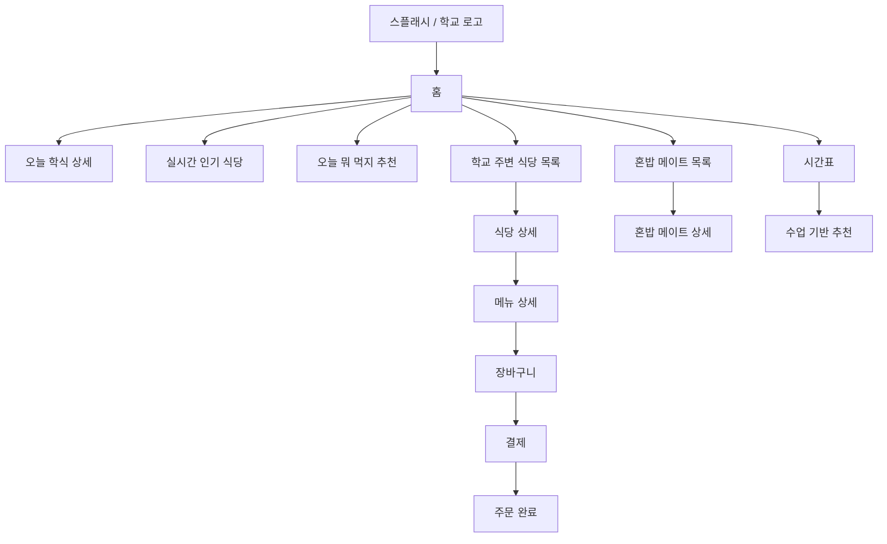
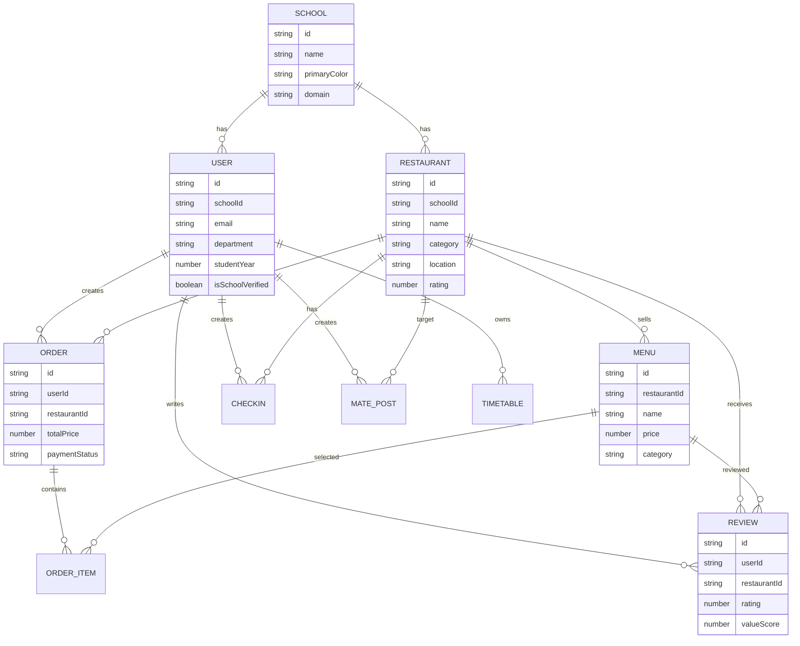

# 대학교 밥먹자 서비스 설계서

## 1. 서비스 개요

대학교 밥먹자는 대학생이 매일 점심, 저녁, 간식 선택을 빠르게 끝낼 수 있도록 돕는 대학교 전용 식당/학식/커뮤니티 앱이다.

서비스 컨셉은 다음 세 가지를 합친 형태다.

- 배달의민족: 식당, 메뉴, 결제, 주문 흐름
- 학교 커뮤니티: 친구들이 가는 곳, 혼밥 메이트, 학생 리뷰
- 학식 앱: 오늘 학식, 시험기간 인기 메뉴, 수업 기반 추천

초기 목표는 한국공학대학교를 기준으로 MVP를 만들고, 이후 학교별 테마 색상, 식당 데이터, 학식 데이터, 인증 정책을 분리해 여러 대학교로 확장하는 것이다.

## 2. 핵심 사용자

### 일반 학생

- 학교 안팎 식당을 빠르게 찾고 싶다.
- 오늘 학식 메뉴와 가격을 확인하고 싶다.
- 지금 인기 있는 식당을 보고 싶다.
- 다음 수업 전까지 갈 수 있는 식당을 추천받고 싶다.
- 혼밥이 싫을 때 같이 먹을 사람을 찾고 싶다.

### 식당 관리자

- 메뉴, 가격, 영업시간을 관리하고 싶다.
- 주문 현황을 확인하고 싶다.
- 인기 메뉴와 리뷰를 보고 싶다.

### 학교/운영 관리자

- 학교별 식당 데이터를 관리한다.
- 학생 인증 정책을 관리한다.
- 리뷰 신고, 부정 주문, 결제 이슈를 관리한다.

## 3. 앱 정보 구조

메인 탭은 MVP에서는 하단 탭 4개로 구성한다.

1. 홈
2. 추천
3. 커뮤니티
4. 마이

상용 버전에서는 다음 탭을 권장한다.

1. 홈
2. 식당
3. 혼밥
4. 시간표
5. 마이

## 4. 화면 흐름



## 5. 메인 화면 구성

메인 화면 순서는 다음과 같다.

1. 오늘 학식 메뉴
2. 실시간 인기 식당 순위
3. 친구들이 현재 가는 식당
4. 오늘 뭐 먹지 추천
5. 학교 주변 식당 목록

### 오늘 학식 카드

목적: 앱을 매일 여는 이유를 만든다.

표시 정보:

- 날짜
- 식당명
- 메뉴 구성
- 가격
- 운영 시간
- 남은 수량 또는 품절 여부

예시:

```text
오늘 학식
제육볶음 / 된장국 / 계란말이 / 김치
4,500원
11:00 - 14:00
```

### 실시간 인기 식당

목적: 선택 피로를 줄이고 트렌드를 보여준다.

기준 데이터:

- 현재 시간대 조회수
- 장바구니 담기 수
- 주문 수
- 체크인 수
- 리뷰 긍정도

MVP에서는 더미 데이터 또는 로컬 랜덤 값으로 시작한다.

### 친구들이 가는 식당

목적: 학교 커뮤니티 감각을 만든다.

표시 정보:

- 식당명
- 현재 체크인 수
- 내 친구 참여 여부
- 예상 혼잡도

개인정보 보호:

- 실명 목록은 기본 비공개
- 친구 공개 설정을 켠 사용자만 표시
- 기본은 "학생식당 23명"처럼 집계형으로 표시

### 오늘 뭐 먹지 추천

목적: 메뉴 선택을 게임처럼 만든다.

구성:

- 카테고리 버튼
- 취향 선택
- 랜덤 추천
- 룰렛 애니메이션
- 다시 추천하기

## 6. 주요 화면 명세

### 스플래시 화면

기능:

- 학교 로고 중앙 표시
- 1.5초에서 2초 애니메이션
- 최초 실행 시 학교 선택 또는 로그인으로 이동
- 이후 실행 시 홈으로 이동

애니메이션:

- opacity 0 -> 1
- scale 0.94 -> 1
- logo slide-in 또는 shimmer 효과

### 식당 목록 화면

카드 표시 정보:

- 식당 이미지
- 식당 이름
- 카테고리
- 별점
- 맛/양/가성비 요약
- 위치
- 운영 상태
- 현재 인기 배지

카드 예시:

```text
학생식당
한식 / 학식
4.5
맛 4.1 양 4.7 가성비 4.8
TIP B1층
운영중
```

### 식당 상세 화면

표시 정보:

- 대표 이미지
- 식당 이름
- 영업시간
- 위치
- 전화번호
- 혼잡도
- 리뷰 요약
- 메뉴 목록
- 혼밥 메이트 모집 버튼

### 메뉴 상세 화면

표시 정보:

- 음식 사진
- 가격
- 상세 설명
- 맛/양/가성비 평가
- 리뷰
- 옵션
- 수량
- 장바구니 담기
- 바로 결제

### 결제 화면

지원 수단:

- 카드 결제
- 카카오페이
- 네이버페이
- 토스페이

MVP:

- 더미 결제 처리
- 주문 완료 화면 이동
- 주문 내역 Firestore 저장

상용:

- PG사 연동
- 서버에서 결제 검증
- 클라이언트에서 카드 정보 직접 저장 금지

## 7. 기능 명세

### 메뉴 추천 시스템

MVP 로직:

1. 사용자가 카테고리 선택
2. 해당 카테고리 메뉴 필터링
3. 랜덤으로 하나 추천
4. 다시 추천하기 가능

확장 로직:

- 주문 이력
- 좋아요
- 시간대
- 날씨
- 다음 수업까지 남은 시간
- 친구들이 많이 가는 식당
- 시험기간 인기 메뉴

추천 점수 예시:

```text
score =
  categoryMatch * 30
  + timeFit * 20
  + distanceFit * 20
  + popularity * 15
  + userPreference * 15
```

### 메뉴 룰렛

기능:

- 메뉴 후보 6개에서 12개 구성
- 회전 애니메이션
- 결과 메뉴 표시
- 다시 돌리기
- 메뉴 상세 이동

### 혼밥 메이트

기능:

- 모집 글 생성
- 식당 선택
- 시간 선택
- 최대 인원 설정
- 참여하기
- 나가기
- 모집 마감

안전 정책:

- 학교 이메일 인증 사용자만 사용
- 신고 기능
- 차단 기능
- 실명 대신 닉네임 사용

### 리뷰

조건:

- 학교 인증 사용자만 작성
- 주문 완료 또는 체크인 기록이 있으면 신뢰 리뷰 배지 부여

평가 항목:

- 별점
- 맛
- 양
- 가성비
- 텍스트 리뷰
- 이미지 리뷰

### 시험기간 모드

트리거:

- 관리자 설정
- 학교 학사 일정
- 사용자가 직접 켜기

표시:

- 시험기간 인기 메뉴
- 카페 혼잡도
- 늦게까지 여는 식당
- 공부 장소 주변 식당

### 시간표

MVP:

- 직접 입력
- 요일, 시작 시간, 종료 시간, 과목명, 장소

확장:

- 학교 포털 연동
- 캘린더 연동
- 다음 수업 기반 식당 추천

## 8. Flutter 프로젝트 구조

```text
lib/
  main.dart
  app.dart
  core/
    constants/
      app_colors.dart
      app_text_styles.dart
      school_theme.dart
    router/
      app_router.dart
    utils/
      date_time_utils.dart
      price_formatter.dart
    widgets/
      app_button.dart
      app_card.dart
      app_empty_state.dart
      app_loading.dart
  data/
    models/
      school.dart
      user.dart
      restaurant.dart
      menu.dart
      order.dart
      review.dart
      timetable.dart
      mate_post.dart
    repositories/
      restaurant_repository.dart
      menu_repository.dart
      order_repository.dart
      review_repository.dart
      timetable_repository.dart
      mate_repository.dart
    sources/
      firestore_source.dart
      mock_source.dart
  features/
    splash/
      splash_screen.dart
    home/
      home_screen.dart
      widgets/
        today_cafeteria_card.dart
        popular_ranking_card.dart
        friend_checkin_card.dart
        recommendation_banner.dart
    restaurant/
      restaurant_list_screen.dart
      restaurant_detail_screen.dart
      widgets/
        restaurant_card.dart
        menu_card.dart
    menu/
      menu_detail_screen.dart
      roulette_screen.dart
    cart/
      cart_screen.dart
      cart_controller.dart
    payment/
      payment_screen.dart
      payment_result_screen.dart
    mate/
      mate_list_screen.dart
      mate_detail_screen.dart
      mate_create_screen.dart
    review/
      review_list_screen.dart
      review_write_screen.dart
    timetable/
      timetable_screen.dart
      timetable_editor_screen.dart
    my/
      my_page_screen.dart
  firebase_options.dart
```

## 9. Firebase 구조

권장 Firebase 제품:

- Firebase Auth: 학생 인증
- Cloud Firestore: 주요 데이터
- Cloud Storage: 식당/리뷰 이미지
- Cloud Functions: 결제 검증, 랭킹 집계, 신고 처리
- Firebase Cloud Messaging: 주문 상태, 메이트 참여 알림
- Remote Config: 시험기간 모드, 학교별 기능 플래그
- Analytics: 추천/주문 전환 분석
- Crashlytics: 앱 오류 추적

## 10. Firestore 컬렉션 설계

```text
schools/{schoolId}
users/{userId}
restaurants/{restaurantId}
menus/{menuId}
orders/{orderId}
reviews/{reviewId}
checkins/{checkinId}
matePosts/{postId}
timetables/{timetableId}
payments/{paymentId}
reports/{reportId}
rankingSnapshots/{snapshotId}
```

### schools

```json
{
  "id": "tuk",
  "name": "한국공학대학교",
  "primaryColor": "#1758A8",
  "secondaryColor": "#068FD3",
  "accentColor": "#01B3CD",
  "logoUrl": "https://...",
  "domain": "tukorea.ac.kr",
  "isActive": true
}
```

### users

```json
{
  "id": "uid",
  "schoolId": "tuk",
  "email": "student@tukorea.ac.kr",
  "nickname": "든든한공대생",
  "department": "컴퓨터공학과",
  "studentYear": 23,
  "role": "student",
  "isSchoolVerified": true,
  "createdAt": "timestamp",
  "updatedAt": "timestamp"
}
```

### restaurants

```json
{
  "id": "student-cafeteria",
  "schoolId": "tuk",
  "name": "학생식당",
  "category": "학식",
  "imageUrl": "https://...",
  "location": "TIP B1층",
  "phone": "031-000-0000",
  "openingHours": {
    "mon": "11:00-14:00",
    "tue": "11:00-14:00"
  },
  "rating": 4.5,
  "tasteScore": 4.1,
  "portionScore": 4.7,
  "valueScore": 4.8,
  "isOpen": true,
  "createdAt": "timestamp"
}
```

### menus

```json
{
  "id": "menu-1",
  "schoolId": "tuk",
  "restaurantId": "student-cafeteria",
  "name": "제육볶음",
  "category": "한식",
  "imageUrl": "https://...",
  "price": 4500,
  "description": "매콤한 제육볶음 정식",
  "tasteScore": 4.4,
  "portionScore": 4.6,
  "valueScore": 4.8,
  "tags": ["한식", "매콤", "든든", "가성비"],
  "isAvailable": true
}
```

### orders

```json
{
  "id": "order-1",
  "schoolId": "tuk",
  "userId": "uid",
  "restaurantId": "student-cafeteria",
  "items": [
    {
      "menuId": "menu-1",
      "name": "제육볶음",
      "quantity": 1,
      "unitPrice": 4500,
      "options": []
    }
  ],
  "totalPrice": 4500,
  "paymentMethod": "kakaoPay",
  "paymentStatus": "paid",
  "orderStatus": "preparing",
  "createdAt": "timestamp"
}
```

### reviews

```json
{
  "id": "review-1",
  "schoolId": "tuk",
  "userId": "uid",
  "restaurantId": "student-cafeteria",
  "menuId": "menu-1",
  "rating": 5,
  "tasteScore": 5,
  "portionScore": 5,
  "valueScore": 4,
  "content": "양 진짜 많음",
  "department": "컴퓨터공학과",
  "studentYear": 23,
  "isVerifiedOrder": true,
  "createdAt": "timestamp"
}
```

## 11. ERD



## 12. API 설계

Firebase를 사용하더라도 클라이언트가 모든 비즈니스 로직을 직접 처리하면 보안이 약해진다. 결제, 랭킹, 신고, 주문 상태 변경은 Cloud Functions API로 분리한다.

### 홈 데이터 조회

```http
GET /schools/{schoolId}/home
```

응답:

```json
{
  "todayCafeteria": {},
  "popularRestaurants": [],
  "friendCheckins": [],
  "recommendationCategories": [],
  "restaurants": []
}
```

### 추천 메뉴

```http
POST /recommendations/menu
```

요청:

```json
{
  "schoolId": "tuk",
  "userId": "uid",
  "category": "한식",
  "timeLeftMinutes": 45
}
```

응답:

```json
{
  "menuId": "menu-1",
  "reason": "다음 수업까지 45분 남아서 가까운 학생식당 메뉴를 추천해요."
}
```

### 주문 생성

```http
POST /orders
```

요청:

```json
{
  "restaurantId": "student-cafeteria",
  "items": [
    {
      "menuId": "menu-1",
      "quantity": 1,
      "options": []
    }
  ]
}
```

### 결제 검증

```http
POST /payments/verify
```

주의:

- 카드 번호는 앱 DB에 저장하지 않는다.
- PG 결제 토큰만 서버에서 검증한다.
- 결제 성공 후 서버가 주문 상태를 변경한다.

## 13. 보안 설계

필수 원칙:

- 클라이언트는 신뢰하지 않는다.
- 결제 금액은 서버에서 재계산한다.
- 카드 정보는 저장하지 않는다.
- 학교 인증 사용자만 리뷰/혼밥 기능 사용 가능
- 관리자 권한은 custom claims로 관리한다.

Firestore Security Rules 방향:

```text
users:
  본인만 읽기/수정 가능

restaurants, menus:
  모두 읽기 가능
  관리자만 쓰기 가능

orders:
  본인 주문만 읽기 가능
  생성은 인증 사용자만 가능
  상태 변경은 Cloud Functions만 가능

reviews:
  인증 사용자만 생성 가능
  본인 리뷰만 수정/삭제 가능

matePosts:
  학교 인증 사용자만 생성/참여 가능
```

## 14. 디자인 시스템

### 브랜드 톤

- MZ 대학생 타겟
- 배달의민족처럼 친근하고 빠른 인상
- 학교 전용 앱처럼 신뢰감 있는 색상
- 카드형 레이아웃
- 둥근 버튼
- 큰 제목, 짧은 문장

### 학교별 테마

한국공학대학교 기준:

- Primary: `#1758A8`
- Sky: `#068FD3`
- Mint: `#01B3CD`
- Background: `#F3F9FF`

학교별로 `school_theme.dart`에서 색상을 교체한다.

### 다크모드

다크모드에서는 완전 검정 대신 딥네이비를 사용한다.

- Background: `#08111F`
- Surface: `#101B2D`
- Text: `#F2F7FF`
- Primary: 학교 대표색 유지

## 15. MVP 개발 범위

1차 MVP:

- 스플래시
- 홈
- 오늘 학식 카드
- 인기 식당 더미 랭킹
- 친구 체크인 더미 데이터
- 추천 배너
- 식당 목록
- 식당 상세
- 메뉴 상세
- 장바구니
- 더미 결제
- 주문 완료

2차 MVP:

- Firebase Auth
- 학교 이메일 인증
- Firestore 식당/메뉴 데이터
- 리뷰 작성
- 혼밥 메이트
- 시간표 직접 입력

3차 MVP:

- 실시간 랭킹
- 실시간 체크인
- 수업 기반 추천
- 시험기간 모드
- 카페 혼잡도
- FCM 알림

## 16. 개발 로드맵

### 0단계: 기획 확정

- 핵심 화면 와이어프레임
- 한국공학대 식당 데이터 정리
- 메뉴/가격 데이터 정리
- 학교 인증 정책 결정

### 1단계: Flutter 앱 골격

- Flutter 프로젝트 생성
- 라우팅
- 테마
- 공통 컴포넌트
- 더미 데이터 기반 홈 화면

### 2단계: 주문 MVP

- 식당 목록
- 식당 상세
- 메뉴 상세
- 장바구니
- 더미 결제
- 주문 완료

### 3단계: Firebase 연결

- Auth
- Firestore
- Storage
- 학교별 데이터 구조
- 기본 Security Rules

### 4단계: 커뮤니티 기능

- 리뷰
- 혼밥 메이트
- 체크인
- 신고/차단

### 5단계: 추천 고도화

- 카테고리 추천
- 룰렛
- 시간표 기반 추천
- 인기 데이터 반영

### 6단계: 상용화 준비

- PG 결제 연동
- 관리자 웹
- 모니터링
- Crashlytics
- 개인정보 처리방침
- 이용약관
- 앱스토어/플레이스토어 배포

## 17. 우선순위

가장 먼저 만들 기능:

1. 홈 화면
2. 식당/메뉴 탐색
3. 장바구니/더미 결제
4. 추천 기능
5. Firebase 데이터 연결

나중에 만들 기능:

1. 실제 결제
2. 혼밥 메이트
3. 실시간 랭킹
4. 시간표 기반 추천
5. 시험기간 모드

초기 상용화 판단 기준:

- 학생들이 매일 앱을 열 이유가 있는가
- 학식 정보가 빠르고 정확한가
- 메뉴 선택 시간이 줄어드는가
- 식당 입장에서 주문/홍보 가치가 있는가
- 학교 인증 기반 커뮤니티가 안전한가
